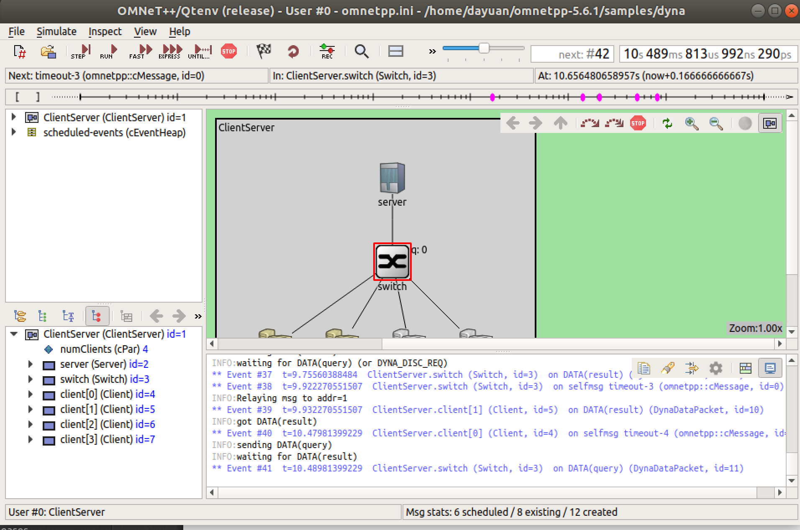

# Install Omnet 5.6.1 on Ubuntu 18.04
Created by Dayuan.

## Step 1:
Download 5.6.1 from official website:
https://omnetpp.org/download/old

## Step 2 Installing the Prerequisite Packages

Before starting the installation, refresh the database of available packages. Type in the terminal:

```$ sudo apt-get update```

To install the required packages, type in the terminal:

```
$ sudo apt-get install build-essential gcc g++ bison flex perl python python3 qt5-default libqt5opengl5-dev tcl-dev tk-dev libxml2-dev zlib1g-dev default-jre doxygen graphviz libwebkitgtk-3.0-0
```

install osgearth development package (and OpenSceneGraph, too) :

```$ sudo apt-get install openscenegraph-plugin-osgearth libosgearth-dev```

To enable the optional parallel simulation support you will need to install the MPI packages:

```$ sudo apt-get install openmpi-bin libopenmpi-dev```

The optional Pcap library allows simulation models to capture and transmit network packets bypassing the operating system’s protocol stack. It is not used directly by OMNeT++, but models may need it to support network emulation.

```$ sudo apt-get install libpcap-dev```

## Step 3 unpack and env variables

Unpack:

```$ tar xvfz omnetpp-5.6.1-src-linux.tgz```

This will create an omnetpp-5.6.1 subdirectory with the OMNeT++ files in it.

Move it to where you want, home is recommended:

```$ mv omnetpp-5.6.1 ~```


To set the environment variables permanently, edit .bashrc in your home directory. Use your favourite text editor to edit .bashrc, for example gedit:

```$ gedit ~/.bashrc```

Add the following line at the end of the file, then save it:

```export PATH=$HOME/omnetpp-5.6.1/bin:$PATH```


## Step 4 Configuring and Building OMNeT++

In the top-level OMNeT++ directory, type:

```~/omnet-5.6.1$ ./configure```

The configure script detects installed software and configuration of your system. It writes the results into the Makefile.inc file, which will be read by the makefiles during the build process.


When ./configure has finished, you can compile OMNeT++. Type in the terminal:

```~/omnet-5.6.1$ make``` # this takes long time


## Step 5 Verifying the Installation

You can now verify that the sample simulations run correctly. For example, the dyna simulation is started by entering the following commands:

```~/omnet-5.6.1$ cd samples/dyna ```

```~/omnet-5.6.1/samples/dyna$ ./dyna```

By default, the samples will run using the Tcl/Tk environment. You should see nice gui windows and dialogs.




## Step 6 Starting the IDE

You can launch the OMNeT++ Simulation IDE by typing the following command in the terminal:

```$ omnetpp```

If you would like to be able to access the IDE from the application launcher or via a desktop shortcut, run one or both of the commands below:

```$ make install-menu-item ```

```$ make install-desktop-icon```

Or add a shortcut that points to the omnetpp program in the ide subdirectory by other means, for example using the Linux desktop’s context menu.
